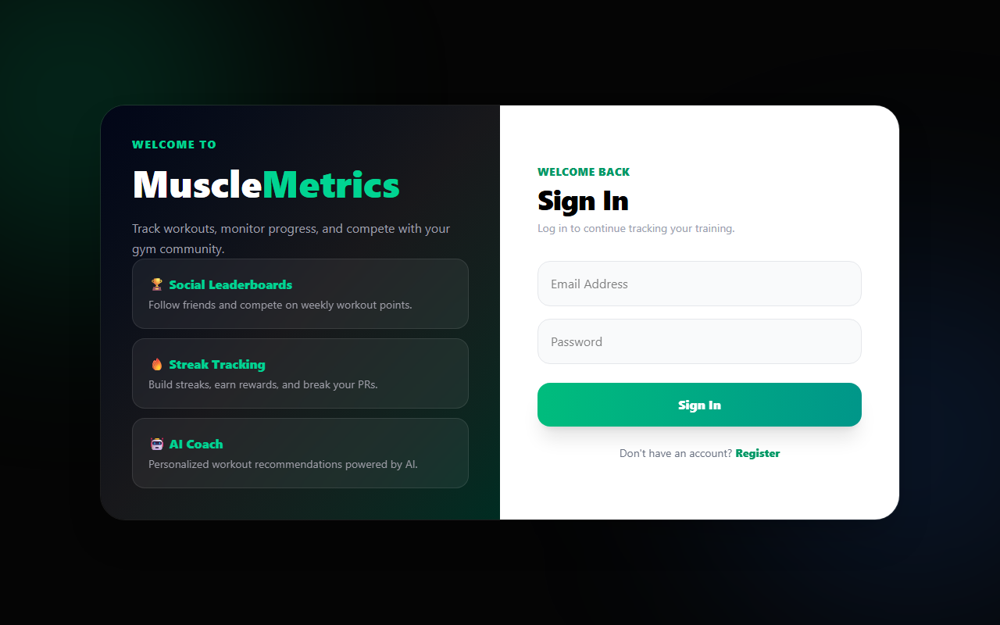
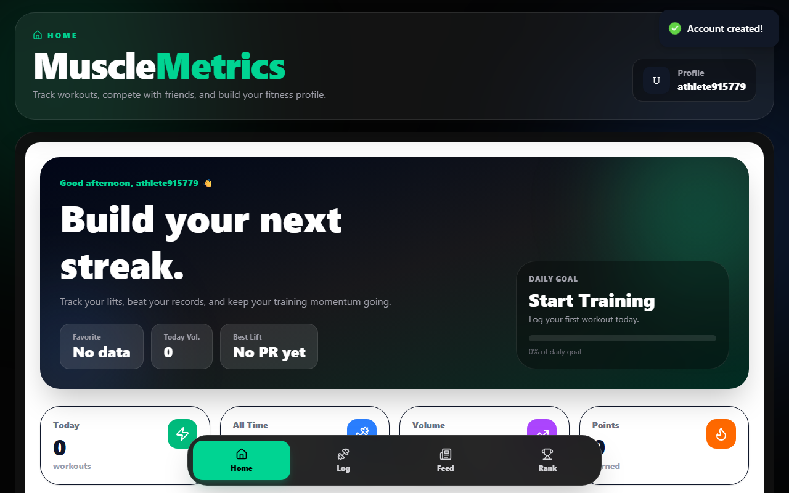
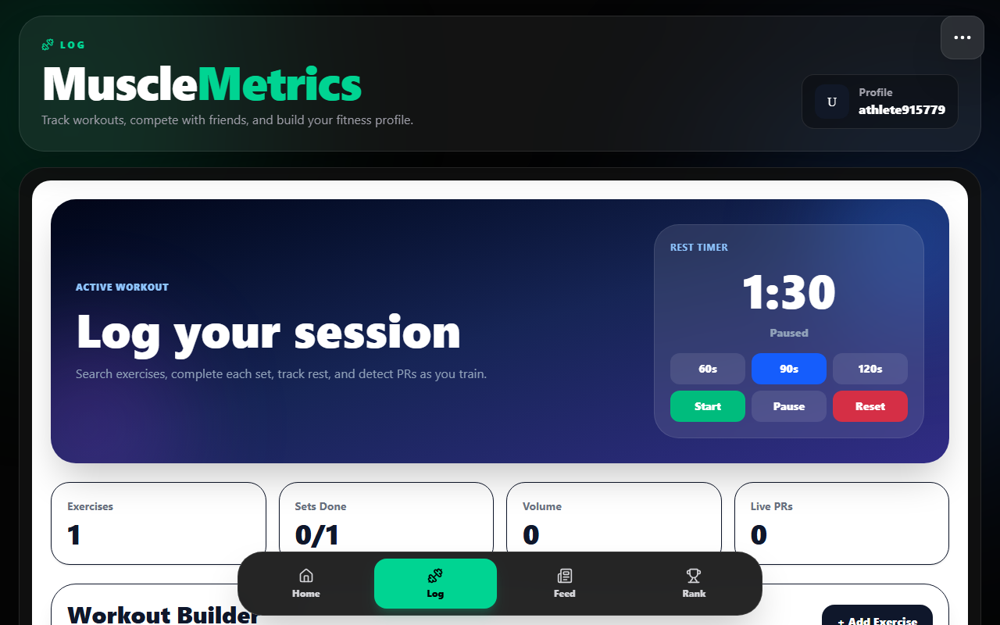
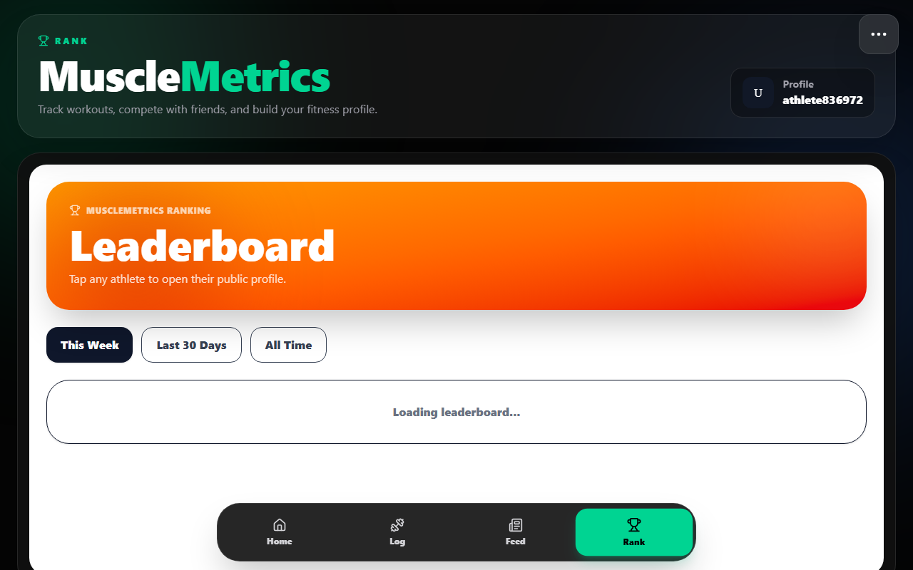
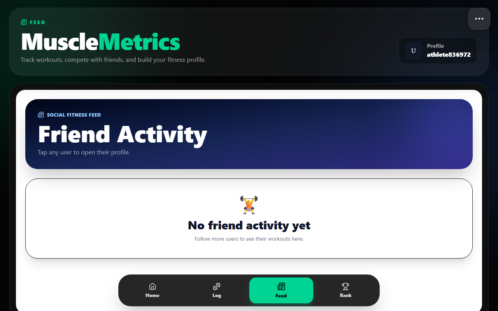
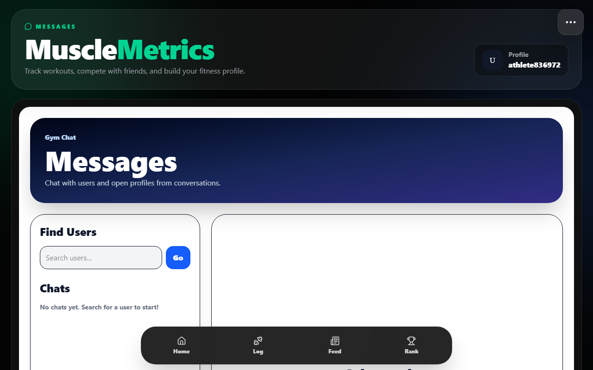
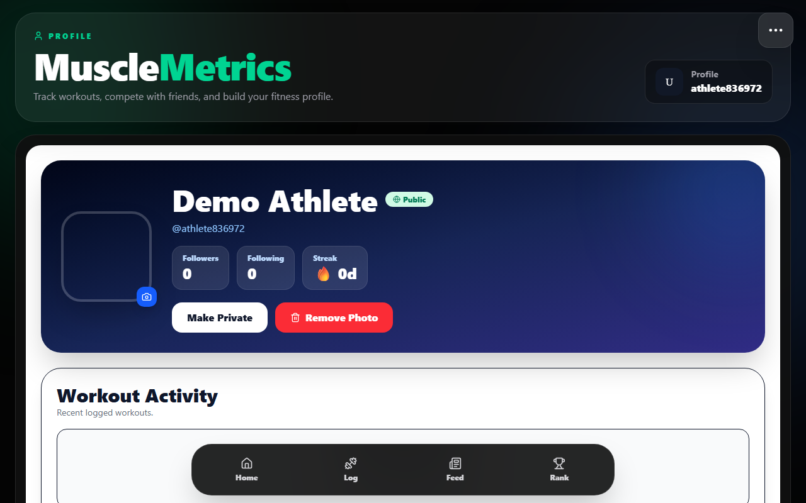
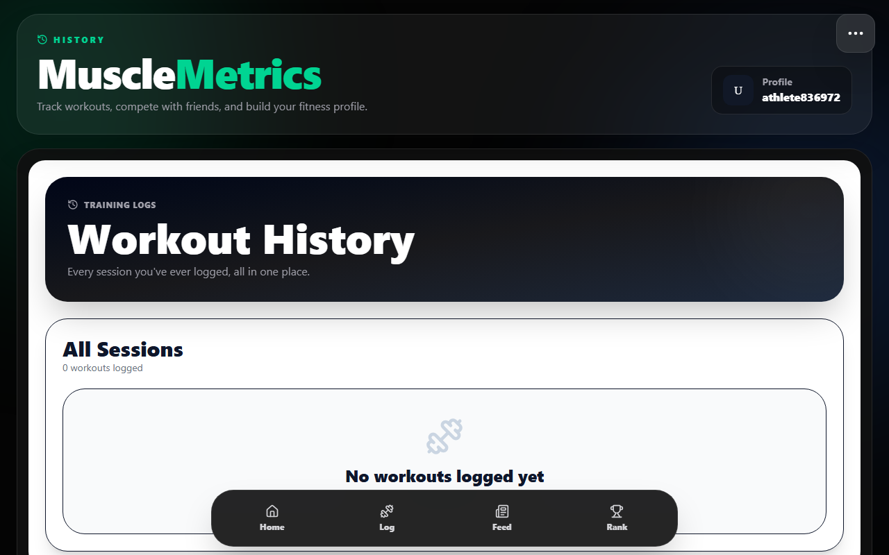

# MuscleMetrics

A full-stack social fitness tracking app. Log workouts, track streaks, compete on leaderboards, and connect with gym partners.

---

## Screenshots

### Auth


### Dashboard


### Log Workout


### Leaderboard


### Activity Feed


### Messages


### User Profile


### Workout History


---

## Features

- **Workout Logger** — Add exercises by muscle group, log sets/reps/weight, detect live PRs, and rest timer
- **Dashboard** — Stats overview, recent workouts, quick actions, training identity
- **Leaderboard** — Weekly, monthly, and all-time rankings with podium display
- **Social Feed** — See friends' workout activity in real time
- **Messaging** — Direct messages with real-time socket updates
- **User Profiles** — Public/private profiles, followers, workout history
- **Streak System** — Daily streak tracking with rewards
- **Notifications** — Follow requests, accepts/declines with in-app popup alerts
- **AI Coach** — Personalized workout recommendations
- **Workout Templates** — Save and reuse training plans
- **PR Tracker** — Personal record tracking per exercise
- **Progress Charts** — Visual workout analytics over time

---

## Tech Stack

**Frontend**
- React 19 + Vite
- Tailwind CSS v4
- Framer Motion
- Recharts
- Socket.IO Client
- Lucide React

**Backend**
- Node.js + Express
- MongoDB + Mongoose
- Socket.IO (real-time)
- JWT Auth
- Cloudinary (profile pictures)
- bcryptjs

---

## Getting Started

### Prerequisites
- Node.js 18+
- MongoDB URI
- Cloudinary account (for profile pictures)

### Backend

```bash
cd backend
npm install
# create .env with MONGO_URI, JWT_SECRET, CLOUDINARY_* vars
npm run dev
```

### Frontend

```bash
cd musclemetrics
npm install
# set VITE_API_URL in .env if backend isn't on localhost:5000
npm run dev
```

---

## Environment Variables

**Backend `.env`**
```
MONGO_URI=your_mongodb_uri
JWT_SECRET=your_jwt_secret
CLOUDINARY_CLOUD_NAME=...
CLOUDINARY_API_KEY=...
CLOUDINARY_API_SECRET=...
PORT=5000
```

**Frontend `.env`**
```
VITE_API_URL=http://localhost:5000
```

---

Built by [Jeet](https://github.com/jeet310704)
